<p align="center">
  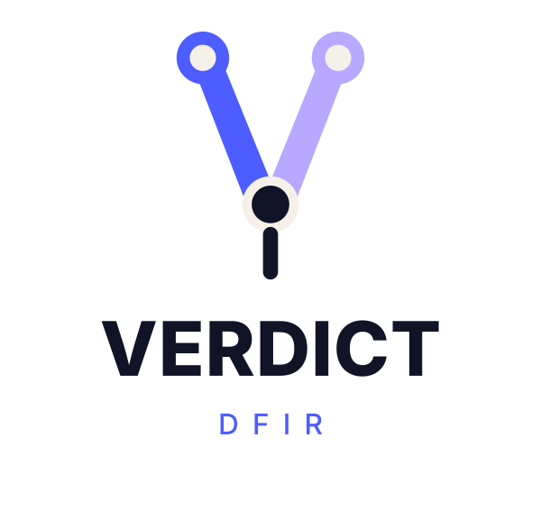
</p>

<p align="center">
  <a href="LICENSE"></a>
  
  
  <a href="https://timothyvang.github.io/verdict-dfir/"></a>
  
  
  
</p>

<p align="center"><b>Show Me the Evidence — 45 typed, read-only, audit-chained forensic MCP tools any AI agent can plug into and drive, with custody you can verify offline.</b></p>

<p align="center">
  <a href="https://timothyvang.github.io/verdict-dfir/"><b>Docs</b></a> ·
  <a href="QUICKSTART.md"><b>Quickstart</b></a> ·
  <a href="https://youtu.be/4RQnVden6L8"><b>Demo</b></a> ·
  <a href="docs/architecture.md"><b>Architecture</b></a> ·
  <a href="docs/brand.md"><b>Brand</b></a> ·
  <a href="docs/contribution-model.md"><b>Contribute</b></a>
</p>

<p align="center">
  <a href="https://github.com/TimothyVang"></a>
  <a href="https://x.com/TimothyVang"></a>
  <a href="https://www.linkedin.com/in/TimothyVang"></a>
  <a href="https://www.youtube.com/@ImTimothyVang"></a>
</p>

---

**VERDICT is DFIR (digital forensics & incident response) for agents** — a typed, read-only,
audit-chained forensic tool surface any AI agent can plug into and drive. Point an agent at a
Windows-host investigation (memory images, EVTX logs, disk artifacts, network captures) and it works
through **45 narrow, schema-validated, read-only MCP (Model Context Protocol) tools**, so every
Finding cites the exact tool call that produced it. The result is an evidence-bound verdict backed by
a cryptographic chain of custody any third party can verify offline. The three verdict words are
scoped tightly: **`SUSPICIOUS`** means reportable evidence was found, **`INDETERMINATE`** means
coverage was too limited to scope a clearance, and **`NO_EVIL`** means no reportable finding in the
artifacts actually examined. `NO_EVIL` is never a whole-environment clean bill of health: coverage is
bounded, and what was not examined is not the same as absent.

The two tool servers are **standard MCP** — any MCP-capable agent can connect to them. VERDICT also
ships its **reference agent**: running `scripts/verdict <evidence>` (or `claude`) in this repo turns
that [Claude Code](https://claude.com/claude-code) session into the analyst — it opens the Case,
drives the tools, runs the verifier, and signs the verdict, with no separate application server. It is
not an autonomous responder: the analyst approves the plan, and before any Finding reaches the report
the verifier re-runs every cited tool to confirm its output reproduces. Replay reproduces the
operation; it does not validate the interpretation.

> **The tools give any agent a read-only forensic surface; the verdict, custody, and verification
> guarantees come from VERDICT's orchestration layer** (the verifier, the ≥2-artifact-class gate, the
> dual-pool ACH (Analysis of Competing Hypotheses), and the signed manifest) — included here, driven by the reference agent today.
> "DFIR for agents" means forensic tools that agents *operate* — **not** forensics of what an agent did.

<p align="center"><sub><b>Drives:</b> memory images · EVTX · disk images (<code>.E01</code>/<code>.dd</code>) · packet captures · registry · MFT · Prefetch · Velociraptor · whole multi-host case folders</sub></p>

- **Plug it into your agent** — two standard MCP stdio servers (32 Rust + 13 Python tools); point your agent at memory/disk/EVTX/PCAP and it has a forensic verb set in seconds.
- **Stay read-only by design** — no `execute_shell`; every tool is a narrow, schema-validated read-only verb, and evidence is hashed first and never mutated.
- **Verify it offline** — runs seal into a hash-chained audit log → Merkle root → signed manifest; `manifest_verify` confirms the whole chain offline.

## Install and run

| Need | Start here |
|---|---|
| Cold-clone install | [`INSTALL.md`](INSTALL.md) |
| Three-command quickstart | [`QUICKSTART.md`](QUICKSTART.md) |
| Every run mode, flag, and output file | [`docs/using/running-verdict.md`](docs/using/running-verdict.md) |
| Failure-mode fixes | [`docs/troubleshooting.md`](docs/troubleshooting.md) |

**One-liner** — clones the repo and runs setup:

```bash
curl -fsSL https://raw.githubusercontent.com/TimothyVang/verdict-dfir-community/main/install.sh | bash
```

This is a convenience wrapper around the steps below, **not** a standalone binary
download. VERDICT is a Claude Code agent over a real forensics toolchain, so the
wrapper still needs `git` and a Claude Code credential present; on a bare machine it
relies on the official Rust/uv/Node installers (driven by setup's `--bootstrap`). It
will not run a Case by itself — it gets you to a green `scripts/setup`. Prefer to see
every step? Run them yourself:

```bash
git clone --depth 1 https://github.com/TimothyVang/verdict-dfir-community.git verdict
cd verdict
bash scripts/setup            # toolchain + DFIR binaries + both MCP servers + preflight doctor
scripts/verdict <path-to-evidence>
```

Before your first Case you also need a **Claude Code credential**: a logged-in `claude`,
`CLAUDE_CODE_OAUTH_TOKEN`, or `ANTHROPIC_API_KEY`. VERDICT drives the tools as a Claude Code agent, so
`scripts/verdict` needs one to run. `scripts/setup` will go green without it; a Case will not.

Point it at supported evidence — a memory image, EVTX log, disk image (`.E01` / `.dd`), packet
capture, Velociraptor collection, or a whole multi-host case folder. Output lands in
`tmp/auto-runs/<case-id>/`. Unsupported formats degrade to custody/limitation records rather than a
broad clearance claim.

Prefer Claude Code interactively? Run `claude` in the repo and type `/verdict <evidence>` or
`investigate <evidence>`.

## Get test evidence

The repo's `evidence/` directory ships empty — real forensic images are far too large to host on GitHub. Drop your own evidence into `evidence/` (or point `$FINDEVIL_EVIDENCE_ROOT` at wherever you keep it) and run `scripts/verdict <image>`.

Public datasets you can download to try VERDICT, mapped to the path each exercises:

| Dataset | Type → VERDICT path | Free source |
|---|---|---|
| **NIST Hacking Case** (Schardt, `SCHARDT.dd`) | disk → registry / prefetch / MFT / EVTX | [cfreds.nist.gov · Hacking Case](https://cfreds.nist.gov/all/NIST/HackingCase) |
| **Nitroba University** (`nitroba.pcap`) | pcap → network triage | [digitalcorpora.org · Nitroba](https://digitalcorpora.org/corpora/scenarios/nitroba-university-harassment-scenario/) |
| **NIST CFReDS** (disk, memory, mobile, more) | mixed | [cfreds.nist.gov](https://cfreds.nist.gov/) |
| **Digital Corpora** (M57-Patents, scenarios) | disk / pcap | [digitalcorpora.org](https://digitalcorpora.org/) |
| **Memory samples** (Volatility-style) | memory → `vol_*` | [github.com/pinesol93/MemoryForensicSamples](https://github.com/pinesol93/MemoryForensicSamples) |
| **Curated image / CTF lists** | everything | [DFIR.Training test images](https://www.dfir.training/downloads/test-images) · [AboutDFIR Challenges & CTFs](https://aboutdfir.com/education/challenges-ctfs/) · ["Where to find DFIR images" — soji256](https://soji256.medium.com/where-can-you-find-images-that-you-can-use-to-learn-forensics-141c6c8cdc9e) · [awesome-forensics](https://github.com/cugu/awesome-forensics) |

**SANS DFIR.** The [SANS SIFT Workstation](https://www.sans.org/tools/sift-workstation) — VERDICT's recommended disk-image parity path — is a free download from the [SANS DFIR community page](https://digital-forensics.sans.org/community/downloads). Note: the enterprise multi-host scenario in our own showcase (a domain controller + file server, the kind used in [SANS FOR508](https://www.sans.org/cyber-security-courses/advanced-incident-response-threat-hunting-training)-style labs) is course lab material and **is not publicly redistributable** — use the public datasets above to reproduce that class of investigation.

## What you get

Every run writes a self-contained case directory:

| Artifact | What it is |
|---|---|
| `audit.jsonl` | Append-only, hash-chained log of every tool call and Finding (`prev_hash` per record) |
| `verdict.json` | The evidence-bound verdict and Findings, each citing a `tool_call_id` and a confidence tier |
| `coverage_manifest.json` | Per-artifact-class scope ledger: available / attempted / parsed / failed / unsupported / not-supplied — the explicit anti-overclaim boundary |
| `run.manifest.json` | Merkle root over canonical tool outputs plus signature metadata — verifiable offline |
| `REPORT.md` / `REPORT.html` / `REPORT.pdf` | Analyst report: Findings, ATT&CK coverage, normalized timeline, next actions. `REPORT.md` is always written; `REPORT.html` (needs pandoc) and `REPORT.pdf` (needs headless Chrome) are produced when those tools are present |

<p align="center">
  
</p>
<p align="center"><sub>Each run seals into a hash-chained audit log, a Merkle root over canonical tool outputs, and a signed manifest — verifiable offline with <code>manifest_verify</code>.</sub></p>

## Reproduce a finding

Don't trust the model. Reproduce the finding. Every Finding cites a `tool_call_id`; the verifier
re-runs that exact tool call, compares the output hash, and re-extracts the value the Finding claims,
so a third party can replay the chain offline.

Worked example, committed for spot-checks: Finding `f-A-evtx-audit-log-cleared` cites `evtx_query`
tool call `tc-002`. Its cited output, SHA-256, verifier replay, and coverage state are in
[`docs/release-evidence/`](docs/release-evidence/); the offline-verification recipe is in
[`docs/cryptographic-attestation.md`](docs/cryptographic-attestation.md). After any run, confirm
`tmp/auto-runs/<case-id>/manifest_verify.json` reports `overall: true`.

A match proves the cited operation reproduces and the custody chain holds. It does not validate the
interpretation; that stays the examiner's call.

## See it run

Every capture below is a real run, not a mockup. Full gallery: [`docs/showcase/`](docs/showcase/).

<p align="center">
  
</p>
<p align="center"><sub>The live dashboard tailing the audit chain as a run lands — tool-cited findings, verifier actions, and the signed verdict, in real time.</sub></p>

<p align="center">
  <a href="https://youtu.be/4RQnVden6L8">
    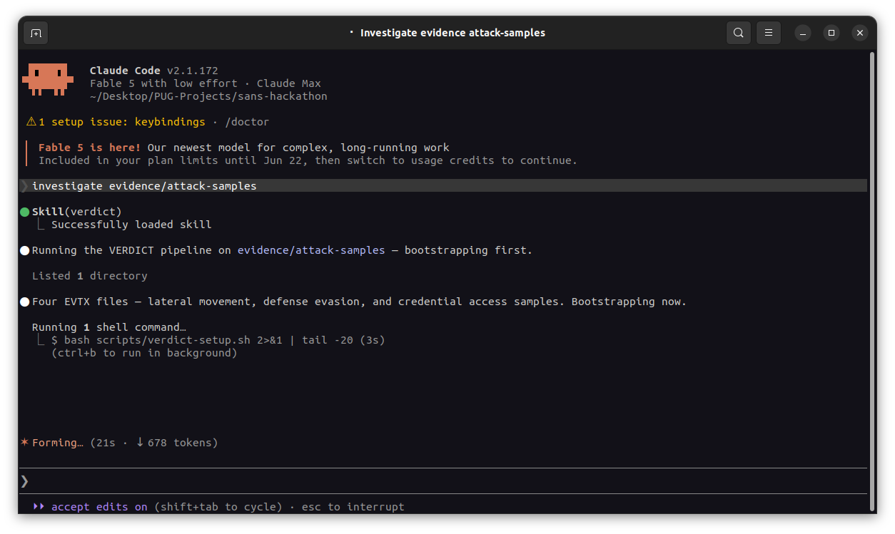
  </a>
</p>
<p align="center"><sub>&#9654; <a href="https://youtu.be/4RQnVden6L8">Watch the full walkthrough (4:35)</a> — one command, the typed DFIR pipeline, a signed verdict you can verify offline.</sub></p>

<p align="center">
  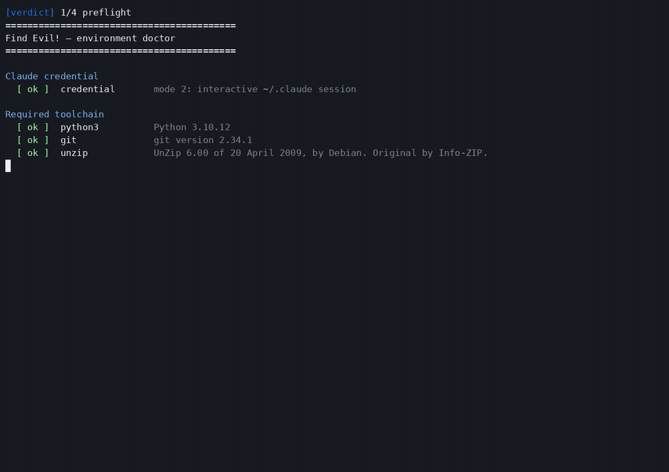
</p>
<p align="center"><sub>One command, the typed DFIR pipeline, a signed <code>SUSPICIOUS</code> verdict with <code>manifest_verify = PASS</code>.</sub></p>

<p align="center">
  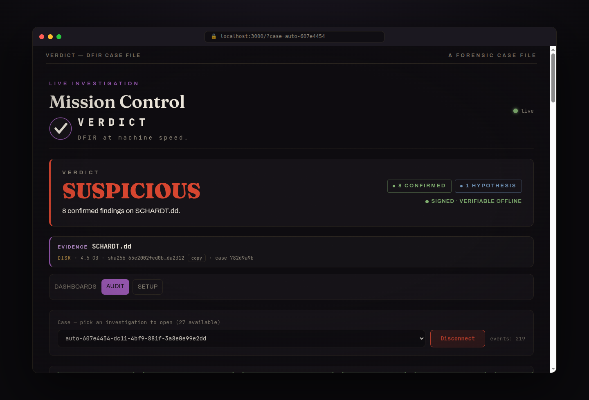
  &nbsp;
  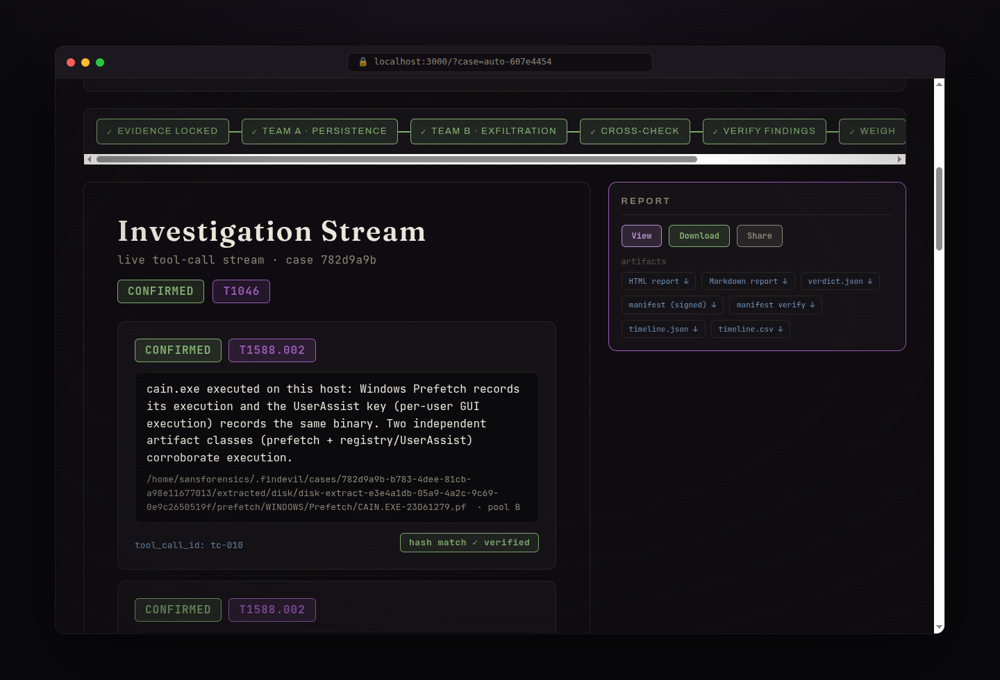
  &nbsp;
  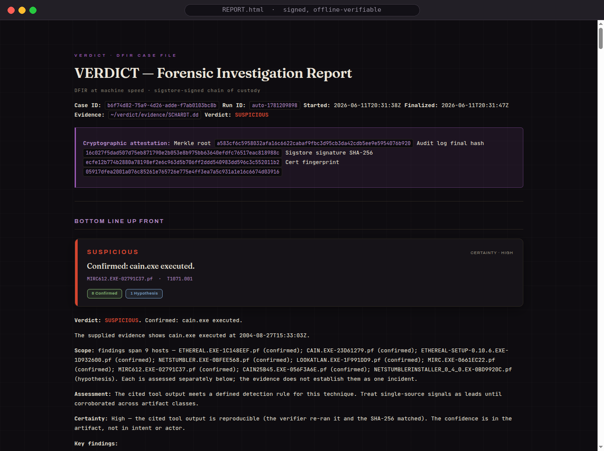
</p>
<p align="center"><sub>The NIST SCHARDT.dd case through SIFT: <code>SUSPICIOUS</code> with 8 findings at CONFIRMED tier (each verifier-passed and backed by two artifact classes): cain.exe, mIRC, Ethereal, NetStumbler, each tool-cited, in a signed report.</sub></p>

<p align="center">
  
</p>
<p align="center"><sub>A 22-host compromised-enterprise case (SRL-2018, 198&nbsp;GB) run host-by-host with the toolchain executing inside the SANS SIFT VM over SSH. <a href="https://youtu.be/4RQnVden6L8">Showcase walkthrough (4:35)</a>.</sub></p>

<p align="center">
  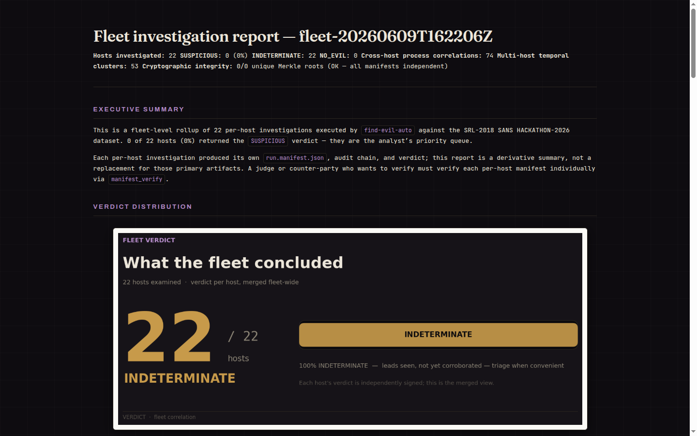
  &nbsp;
  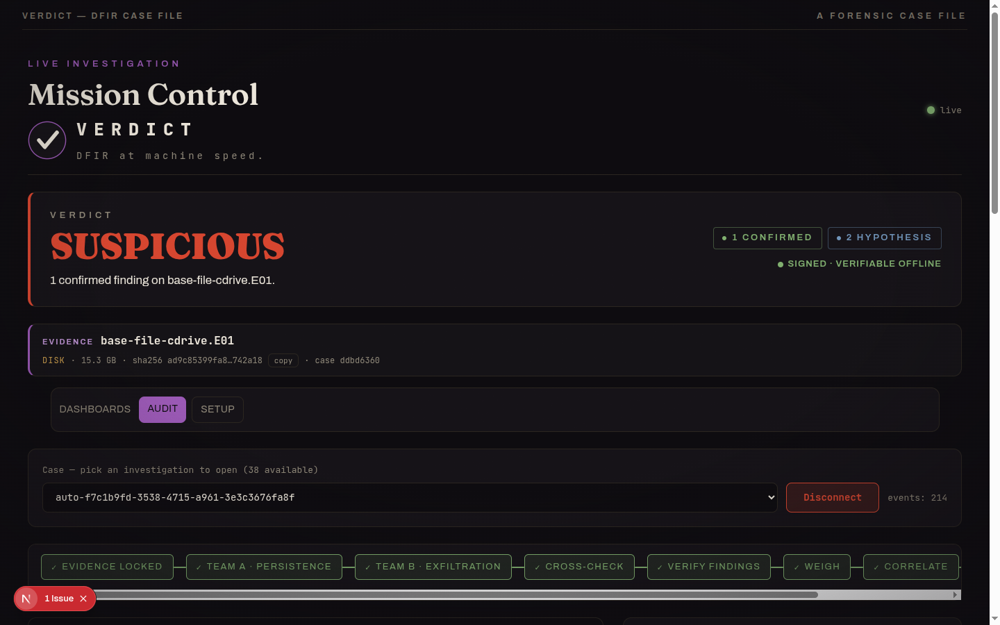
</p>
<p align="center"><sub>Cross-host fleet rollup, and the <code>base-file</code> server flagged <code>SUSPICIOUS</code> on a confirmed Security-log clear (EID&nbsp;1102), with PowerShell-LOLBin and service-install leads held at <code>HYPOTHESIS</code>.</sub></p>

### Videos

Short, narrated walkthroughs on YouTube ([@ImTimothyVang](https://www.youtube.com/@ImTimothyVang)),
built from the same Remotion pipeline (`scripts/make-demo-video/`, see
[`CAPTURE.md`](scripts/make-demo-video/CAPTURE.md)). Hosted, not committed.

| Video | What it covers |
|-------|----------------|
| [Product showcase (4:35)](https://youtu.be/4RQnVden6L8) | The full end-to-end run, host-by-host on a 22-host enterprise |
| [Live agent & self-correction (6:37)](https://youtu.be/jw6etogNzhY) | The agent live on a real NIST disk image: it drives the typed read-only tools and self-corrects on camera when one is unavailable |
| [Educational explainer (2:39)](https://youtu.be/m703-Ox60AI) | What VERDICT is: Case → Findings → Verdict, tool-cited receipts, the three verdict words |
| [Feature deep-dives (2:04)](https://youtu.be/puN0s0iNwy8) | Self-correction, the live dashboard, and offline tamper/verify (real footage) |
| [Quickstart](https://github.com/TimothyVang/verdict-dfir/releases/download/v0.1.0/verdict-quickstart.mp4) | Install and your first signed run, in two commands |
| [**Help build VERDICT (2:13)**](https://youtu.be/4iJs1dQCYbY) | What it is, the non-negotiable invariants, and the contributor on-ramp |

> Building or re-voicing them: `bash scripts/make-demo-video.sh --all`
> (local Piper voice by default; `TTS_ENGINE=elevenlabs` for the cloud voice).

## How it works

Every Case runs the same nine-stage pipeline, each stage landing live on the dashboard as it completes:

<p align="center">
  
</p>

1. **Evidence locked** — `case_open` SHA-256s the evidence and opens a read-only Case.
2. **Persistence pool** — the first analysis pool forks as a subagent and hunts persistence with the typed DFIR tools; every Finding cites the `tool_call_id` that produced it.
3. **Exfiltration pool** — a second pool works the same evidence in parallel with an exfil-biased prior, so competing hypotheses surface instead of hiding in consensus.
4. **Cross-check** — `detect_contradictions` flags disagreeing Findings before anything merges.
5. **Verify** — the verifier re-runs each cited tool, compares output hashes, and **re-extracts the value the Finding asserts** from that output; a Finding whose output drifted, or whose asserted value isn't actually in the evidence, is rejected ([fact-fidelity](docs/fact-fidelity.md)).
6. **Weigh** — `judge_findings` merges by claim with credibility weighting; execution claims need ≥2 artifact classes or stay `HYPOTHESIS`.
7. **Correlate** — `correlate_findings` stitches the survivors into one attack story.
8. **Sign** — `manifest_finalize` seals the run into a hash-chained, Merkle-rooted, signed manifest.
9. **Report** — the analyst report and the verdict.

Three design choices carry the weight:

1. **A typed MCP tool surface — no `execute_shell`.** 45 narrow, schema-validated product tools: 32
   Rust DFIR tools (`case_open`, `vol_pslist`/`psscan`/`psxview`, `mft_timeline`, `evtx_query`,
   `hayabusa_scan`, `yara_scan`, `registry_query`, `prefetch_parse`, `pcap_triage`, and allow-listed
   long-tail wrappers) plus 13 Python crypto/analysis tools. Copyleft and source-available engines
   (Hayabusa, pandoc, tshark, Volatility 3, Velociraptor) are invoked as subprocesses only, keeping
   the Apache-2.0 tree license-clean.
2. **A cryptographic chain of custody.** Hash-chained audit log → Merkle root over canonical-JSON
   tool outputs (computed by the Python manifest builder, mirroring `rs_merkle` semantics) → a signed
   manifest. The default signer is a local Ed25519 key that verifies offline; Sigstore/Rekor is the
   identity and transparency-log tier. `manifest_verify` checks the chain and root offline, and
   customer-release candidates carry an expert-signoff packet. This is about integrity and offline
   replayability, not admissibility; the courtroom framing (FRE 902(14)) and its caveats live in
   [`docs/cryptographic-attestation.md`](docs/cryptographic-attestation.md).
3. **Analysis of Competing Hypotheses as agent topology.** Two pools investigate the same evidence
   with opposing priors. Their disagreements are emitted as first-class `kind=contradiction` records
   before a credibility-weighted judge merges them — surfaced, not hidden. Two pools do not prove
   truth; the replayable tool-output chain does.

How the agent teams actually solve a case — a supervisor forks the persistence-biased **Pool A** and
exfiltration-biased **Pool B** in parallel over the typed read-only tool surface (with cross-case
memory for recall), their disagreements surface *before* a verifier → judge → correlator reconcile
them, and every step lands in the hash-chained custody record:

<p align="center">
  
</p>

Findings follow a strict epistemic hierarchy — **CONFIRMED** (≥2 corroborating artifact classes,
verifier-passed) > **INFERRED** (derived from confirmed facts) > **HYPOTHESIS** — and execution
claims require at least two artifact classes.

> **Maturity note.** The long-tail verbs (`vol_run`, `ez_parse`, `plaso_parse`, `mac_triage`,
> `cloud_audit`, `journalctl_query`, `login_accounting`, `ausearch`, `nfdump_query`, `suricata_eve`,
> `indx_parse`) are typed, allow-listed, and unit-tested against fixtures, but not yet exercised on
> real evidence in a committed run. Committed sample runs exercise the core disk / registry / EVTX /
> MFT / Prefetch / Hayabusa / USN / PCAP and `vol_*` memory paths (each with a real tool call in a
> committed `audit.jsonl`; see [Results](#results-whats-proven)). `yara_scan`, `sysmon_network_query`,
> `zeek_summary`, `vel_collect`, and `browser_history` are typed and fixture-tested but not yet in a
> committed real-evidence run.

## Architecture

The whole workflow as one picture — every boundary is crossed only through a typed, read-only tool
whose output is hash-chained into custody: the read-only **evidence vault** → **SIFT tool
subprocesses** → **two typed MCP servers** → the **Claude Code agent loop** → **cryptographic
custody** → the **presentation** layer, with trust boundaries marked.

<p align="center">
  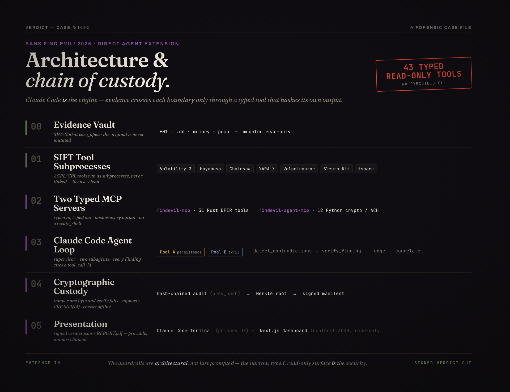
</p>

The same pipeline mapped to the repository — entrypoints (`scripts/`), the agent loop governed by
`agent-config/`, the `.mcp.json` surface (product servers `findevil-mcp` + `findevil-agent-mcp` =
45 audit-chained tools, plus the n8n / playwright / puppeteer / qmd convenience servers that never
emit findings), the SIFT DFIR tools, the read-only evidence vault, the custody chain
(`audit.jsonl` → `manifest_finalize` → `manifest_verify`), and the outputs:

<p align="center">
  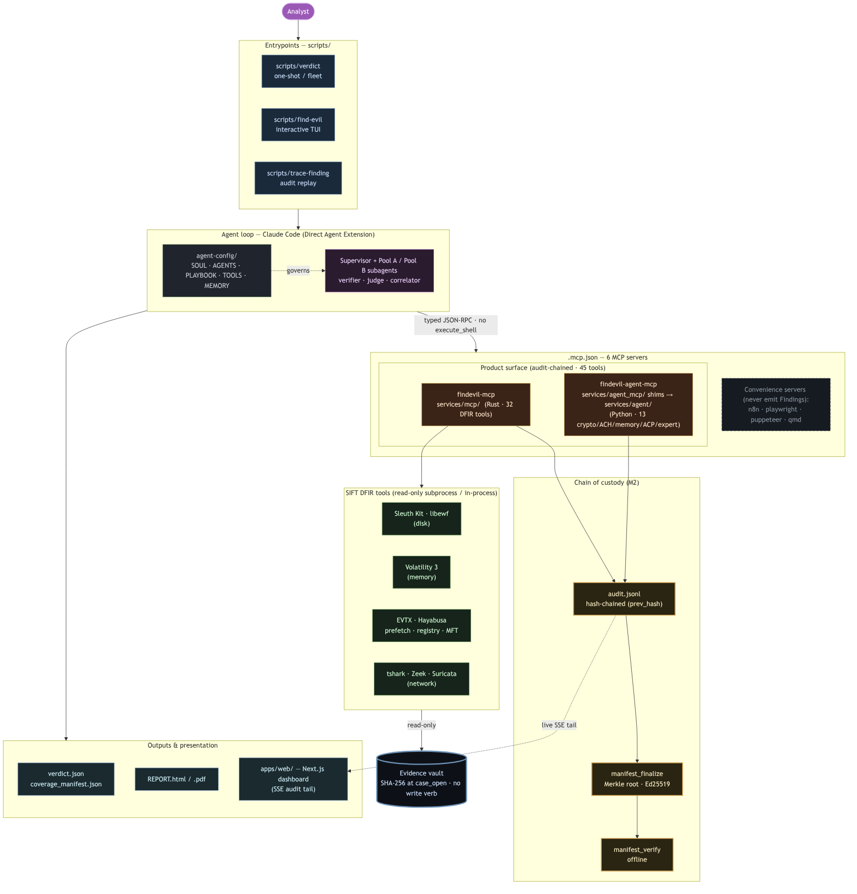
</p>

Trust-boundary detail and the agent topology are in [`docs/architecture.md`](docs/architecture.md).

### Fact-fidelity — a finding can't assert a value that isn't in the evidence

A valid `tool_call_id` proves a finding points at real, unchanged evidence — not that the model
*read it right*. So a CONFIRMED finding declares the structured value(s) it claims, and after the
cited output reproduces, a pure, **LLM-free** check re-extracts each value from that output: a
misread (a value not in the evidence) is **rejected before it can reach the Verdict**, and the
recorded fact is the value the parser read, not the model's transcription. This is
**structured-value fidelity** — registry / EVTX / prefetch / MFT / USN fields — **not**
"hallucination solved": interpretation has no deterministic oracle and stays HYPOTHESIS,
human-owned. See it catch a misread on purpose with
`FIND_EVIL_FAULT_INJECT=entailment_misread_once`, or run `python3 scripts/entailment-demo.py`.
Details: [`docs/fact-fidelity.md`](docs/fact-fidelity.md).

<p align="center">
  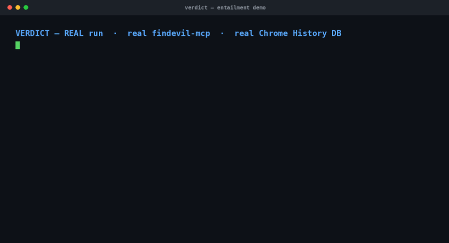
</p>
<p align="center"><sub>A <b>real run</b> — the compiled <code>findevil-mcp</code> re-runs the cited tool on real evidence: an honest finding is <b>approved</b>, an injected misread is <b>rejected</b> before it can reach the verdict. Full-resolution <a href="docs/showcase/fact-fidelity-demo.mp4">mp4</a>.</sub></p>

## Capabilities

- **Disk and memory in one Case.** With local Sleuth Kit/libewf support or in SIFT mode, it opens
  raw/E01 images read-only and extracts `$MFT`, registry hives, EVTX, and Prefetch
  (`disk_mount` / `disk_extract_artifacts` / `disk_unmount`), then analyzes memory in the same Case.
  Raw disk with no supported mounted/extracted content stays custody-only and honestly `INDETERMINATE`.
  Supported disk images can be parsed locally through Sleuth Kit direct-read when prerequisites are present; `case_open` alone remains custody-only, and unsupported artifact classes stay as named limitations.
  ([tool inventory](docs/reference/mcp-and-tools.md))
- **Self-verifying Findings.** `verify_finding` re-runs each cited tool call and confirms the output
  SHA-256 still matches; `detect_contradictions` raises pool conflicts as first-class records before
  the judge merges — so a third party can independently replay the chain. ([tools](agent-config/TOOLS.md))
- **Fleet scale.** Run a whole estate, not one box: the investigate → correlate → render pipeline
  produces a single cross-host `FLEET_REPORT` surfacing signals that only appear across machines —
  the same uncommon process on many hosts, near-simultaneous process-creation waves, MITRE-technique
  spread. (On a 22-host SANS estate it correlated the same uncommon image across 20 of 22 hosts;
  per-host custody still required.) Runs in the SANS
  SIFT VM ([fleet analysis](docs/using/fleet-analysis.md)) or per-host locally with no VM
  ([whole-case local run](docs/using/whole-case-local-run.md)).
- **Optional post-verdict action.** When the operator deploys an n8n workflow, a verdict can drive a
  notification, ticket, or containment step. Out of the box no workflow is deployed, so the step
  records as skipped. Either way it sits outside the audit chain — never evidence, never a Finding.

## Accuracy and scope

If no parser or tool extracts an artifact class, VERDICT cannot reason over it — that is the trust
boundary, not a footnote. Every run writes a `coverage_manifest.json` sidecar (and embeds the same
object in `verdict.json`) with one row per artifact class. The strongest claim is not "the AI
reviewed the whole image"; it is that the cited artifacts were examined through replayable tools.
Disputed or unsupported leads stay visible as contradictions, `HYPOTHESIS`, or
`analysis_limitations`.

Accuracy is measured against published answer keys, not asserted. The repo ships small answer keys
under `goldens/`; large fixtures are staged with `scripts/fetch-fixtures.sh`, then scored with
`scripts/score-recall.py tmp/auto-runs/<case-id> --golden goldens/<case-id>`. Method, corpus shape,
false-positive controls, and honest limits are in [`docs/accuracy-report.md`](docs/accuracy-report.md);
local `evidence/` drop-zone cases that have committed score keys are mapped in
[`docs/evidence-answer-keys.md`](docs/evidence-answer-keys.md); and the adversarial "break VERDICT"
challenge is in [`docs/red-team-challenge.md`](docs/red-team-challenge.md). A compact committed
execution trace for reviewer spot-checks lives in
[`docs/release-evidence/`](docs/release-evidence/): Finding `f-A-evtx-audit-log-cleared` maps to
`evtx_query` tool call `tc-002`, with verifier replay and token usage recorded.

## Results: what's reproducible

VERDICT is scored on two axes against published answer keys: does it surface known activity, and does
it refuse to overclaim when coverage is thin. The scored rows below have committed receipts and are
reproducible with `scripts/score-recall.py`; full method and caveats are in
[`docs/accuracy-report.md`](docs/accuracy-report.md).

| Case | Evidence | Recall (bar) | Run verdict | What it shows |
|---|---|---|---|---|
| **Nitroba** | network (PCAP) | **5/5 = 100%** (80%) | `INDETERMINATE` | Full network-evidence recall with no over-attribution. All five golden facts surfaced; attribution stays `INFERRED` / `HYPOTHESIS`, so the verdict scopes down. The strongest single result. |
| **NIST Hacking Case** | disk (Windows XP) | **7/14 = 50%** (5/14 floor; bar 71%) | `SUSPICIOUS` | 8 CONFIRMED tool-artifact findings, including Prefetch-backed tool-use evidence with corroboration details in the report; shellbag staging, LNK and Recycle-Bin traces, a suspiciously-named local account (SAM, T1136.001), OpenSaveMRU. Below the bar, up from 1/14. Seven misses (search / USB / email / browser history, XP `.evt`, thumbcache, named-pipe) **published, not hidden**. |

Of 10 scoreable goldens, **1 is fully scored and passing** (Nitroba) and **1 is scored and
failing-but-improving** (NIST); the other 8 are fixture-staged and **not yet run, with no number
fabricated**. Staged controls include `synthetic-benign` (expected `NO_EVIL` / 0 findings) and
`alihadi-09-encrypt` (dual-use crypto should not become an overconfident `SUSPICIOUS`). NIST recall is
run-dependent (5/14 floor, 7/14 best committed).

### Artifact classes proven on committed runs

Each is backed by a real tool call in a committed `audit.jsonl`:

- **Disk**: raw/`.E01` mount + extract, `$MFT` (`mft_timeline`), registry hives (`registry_query`), Prefetch (`prefetch_parse`)
- **Windows event logs**: `evtx_query`, plus a Hayabusa/Sigma sweep at lead-tier (`hayabusa_scan`)
- **NTFS USN journal**: `usnjrnl_query`
- **Network**: PCAP triage (`pcap_triage`)
- **Memory**: Volatility 3 active list, pool scan, cross-view, injection (`vol_pslist`, `vol_psscan`, `vol_psxview`, `vol_malfind`)
- **Custody intake**: `case_open` SHA-256 over the evidence

The long-tail verbs (`vol_run`, `ez_parse`, `plaso_parse`, `mac_triage`, `cloud_audit`,
`journalctl_query`, `login_accounting`, `ausearch`, `nfdump_query`, `suricata_eve`, `indx_parse`)
plus `yara_scan`, `sysmon_network_query`, `zeek_summary`, `vel_collect`, and `browser_history` are
typed and fixture-tested, **not yet exercised on real evidence in a committed run**.

### Wins, with the receipt

**Suspicious log clearing caught with full custody, zero LLM calls.** A fresh deterministic run on the public `EID 1102`
Security-log-clear fixture, signed and offline-verifiable:

```text
seq  1  tool_call_start   case_open    tc-001
seq  2  tool_call_output  tc-001   output_sha256 a0615707…   (= the evidence SHA-256)
seq  3  tool_call_start   evtx_query   tc-002
seq  4  tool_call_output  tc-002   output_sha256 3d3dd694…
seq 17  finding_approved  f-A-evtx-audit-log-cleared  cites tc-002  (T1070.001)
verifier replay matched : true
manifest_verify          : overall true · ed25519 signature_verified · merkle c7f9a8bf…
token_usage              : llm_api_calls 0 · total_tokens 0   (deterministic headless path)
coverage                 : parsed [custody, evtx] · not_supplied [disk, memory, network, velociraptor] · 7 ATT&CK blind spots kept visible
```

That `output_sha256 3d3dd694…` and finding ID reproduce in the committed trace
([`docs/release-evidence/evtx-security-log-clear-trace-summary.json`](docs/release-evidence/evtx-security-log-clear-trace-summary.json)).
Run it and compare.

**Custody you can verify offline.** Every run seals into a hash-chained `audit.jsonl`, a Merkle root
over canonical tool outputs, and an ed25519-signed manifest:

```text
manifest_verify : overall true · audit_chain_ok · leaf_count_ok · merkle_root_ok · entailment_ok · ed25519 signature_verified
```

→ [`docs/release-evidence/sample-run/manifest_verify.json`](docs/release-evidence/sample-run/manifest_verify.json)

**Self-correction under real failure (organic, not injected).**

```text
organic     : fault_injection_present false  ("the string fault_injection never appears in the audit chain")
trigger     : registry_query failed on truncated RegBack hives (SAM / SECURITY / SOFTWARE)
adjustment  : course_correction = "narrow (skip this key; continue remaining hive triage)"   x6
escalation  : heartbeat_failure = "escalate" -> honest partial INDETERMINATE over what was examined   x5
audit chain : 311 hash-chained records (excerpt seq 169-183)
```

→ [`docs/release-evidence/natural-self-correction-summary.json`](docs/release-evidence/natural-self-correction-summary.json)

**Self-correction in code, first-pass.** The textbook DKOM signature (`vol_pslist`=0 vs
`vol_psscan`=124) was refused as a rootkit: OS singletons recovered only by `psscan`, plus a duplicate
`System` PID, point to acquisition smear, which a rootkit cannot produce. The engine re-sequenced to
`vol_psxview` and scoped to `INDETERMINATE`, with no post-run patch
([`docs/accuracy-report.md`](docs/accuracy-report.md)).

Don't trust the model. Reproduce any row: `scripts/verdict <evidence>` then
`scripts/score-recall.py tmp/auto-runs/<case-id> --golden goldens/<case-id>`.

## Built from practitioner feedback

When VERDICT launched we posted it to r/computerforensics, r/digitalforensics, and r/rust and asked,
directly, *"where does this break?"* Practitioners pushed back hard. They flagged hallucination (a
valid `tool_call_id` proves a finding *points at* real output, not that the model *read it right*),
two same-model pools converging on a shared blind spot, and court-defensibility. We shipped against
that feedback. The headline response is the deterministic, LLM-free
**[fact-fidelity gate](docs/fact-fidelity.md) described above, now on by default**: a misread is
**rejected before it reaches the verdict**. Around it sit honest `INDETERMINATE` and coverage
semantics, plus an audit chain that logs every rejection visibly instead of silently dropping it.

This is enforced where findings declare values. It is **not "hallucination solved"**: interpretation
has no deterministic oracle and stays human-owned. The full point-by-point (what they said, what we
shipped, and what is still open) lives in **[docs/community-response.md](docs/community-response.md)**,
and you can watch the live agent self-correct on camera in the
[feature deep-dive (6:37)](https://youtu.be/jw6etogNzhY).

## Running a Case

You cloned and ran `bash scripts/setup` under [Install and run](#install-and-run) above. This section
covers what that command does, its variants, the SIFT option, and how to drive a Case. Full step list:
[QUICKSTART.md](QUICKSTART.md).

`bash scripts/setup` installs the toolchain (Rust, uv, Node, pnpm) and the supported local DFIR
binaries it can manage (Volatility 3, Hayabusa, Chainsaw, Velociraptor, Sleuth Kit, tshark, pandoc —
YARA is built into the Rust binary), builds and verifies both MCP servers, runs the preflight
`doctor`, and prints an honest green/amber summary. Common variants:

```bash
bash scripts/setup --run         # install, then watch evidence/ and investigate on drop
bash scripts/setup --with-sift   # install local prerequisites and provision the SANS SIFT VM
bash scripts/setup --json        # machine-readable status for scripts/CI
```

<p align="center">
  
</p>
<p align="center"><sub><code>scripts/doctor.sh</code>: one preflight, an honest green/amber summary, then you are ready to run.</sub></p>

The **SANS SIFT VM** is the reference forensic environment and provides the full workstation baseline
for disk-image parity; `--with-sift` fetches the gated 9.3&nbsp;GB OVA headlessly and builds the VM,
falling back cleanly to local mode (memory, EVTX, PCAP, Velociraptor, and supported disk artifacts)
on any failure. Full prerequisites are in [INSTALL.md](INSTALL.md); per-environment detail (local vs.
SIFT VM) is in [QUICKSTART.md](QUICKSTART.md).

To run a Case, point `verdict` at a single image or a mixed case directory (memory + EVTX + disk +
network + Velociraptor):

```bash
scripts/verdict <path-to-evidence>
#   --sift          run the DFIR tools inside the SANS SIFT VM (default: local host)
#   --watch         watch evidence/ and investigate on the next drop
#   --no-dashboard  do not auto-open the browser
```

The dashboard at `http://localhost:3000` streams the run live. Evidence files are never committed
(they are gitignored), so a fresh clone ships with none — stage public datasets with
`bash scripts/fetch-fixtures.sh` (sources and SHA-256 in [docs/DATASET.md](docs/DATASET.md)) or drop
your own image into `evidence/`. Every run is a live test: confirm `tmp/auto-runs/<case-id>/verdict.json`
carries a real verdict and `manifest_verify.json` reports `overall: true`.

<p align="center">
  
</p>
<p align="center"><sub>Agent mode: one prompt scopes the evidence (four EVTX samples — lateral movement, defense evasion, credential access) and bootstraps the pipeline.</sub></p>

## Repository layout

```
.
├── agent-config/        — runtime agent identity (SOUL / AGENTS / PLAYBOOK / TOOLS / MEMORY)
├── services/mcp/        — Rust MCP server (32 typed DFIR tools)
├── services/agent_mcp/  — Python MCP server (13 crypto / ACH / memory tools)
├── services/agent/      — findevil_agent package (crypto chain + ACH primitives)
├── apps/web/            — Next.js dashboard (live audit-stream viewer + design system)
├── scripts/             — verdict launcher, report renderer, CI smoke runners
├── docs/                — reference/ (tools + deps + env), using/ (how to run), architecture, crypto attestation
└── .mcp.json            — Claude Code auto-spawn registry: 6 MCP servers (2 product + 4 non-product helpers)
```

## Documentation

- [Published docs](https://timothyvang.github.io/verdict-dfir/) — GitHub Pages site
- [docs/README.md](docs/README.md) — canonical documentation index
- [docs/using/running-verdict.md](docs/using/running-verdict.md) — every flag, run mode, and output file
- [docs/reference/mcp-and-tools.md](docs/reference/mcp-and-tools.md) — full MCP-server and tool inventory ([dependencies](docs/reference/dependencies.md))
- [docs/architecture.md](docs/architecture.md) — trust boundaries and the agent topology
- [docs/cryptographic-attestation.md](docs/cryptographic-attestation.md) — chain of custody and FRE 902(14)
- [docs/verdict-semantics.md](docs/verdict-semantics.md) — what `SUSPICIOUS` / `INDETERMINATE` / `NO_EVIL` mean
- [docs/false-positives.md](docs/false-positives.md) — how VERDICT avoids over-claiming
- [docs/fact-fidelity.md](docs/fact-fidelity.md) — the deterministic entailment check (a finding can't assert a value not in its cited evidence)
- [docs/community-response.md](docs/community-response.md) — launch criticism (Reddit) answered point by point: what we said we'd fix, what shipped, what's still open
- [docs/provability-standard.md](docs/provability-standard.md) — the vendor-neutral standard for a *provable* AI forensic finding
- [docs/trust-benchmark.md](docs/trust-benchmark.md) — the "did the AI overclaim?" reproducible benchmark
- [docs/trust-leaderboard.md](docs/trust-leaderboard.md) — the AI-DFIR trust leaderboard (VERDICT's reference run)
- [docs/release-surface.md](docs/release-surface.md) — canonical release channel, archive exclusions, and public-source boundaries

> **For coding agents:** read [CLAUDE.md](CLAUDE.md) first — it encodes the document hierarchy, the
> non-negotiable invariants, and the coding principles for this repo.

## Contributing

Help is welcome — especially from people who know DFIR, memory forensics, or LLM evaluation.
Start with [docs/help-wanted.md](docs/help-wanted.md) for the open problems (including the hard one:
keeping the AI honest) and [CONTRIBUTING.md](CONTRIBUTING.md) for build/test/submit mechanics.

- **Found a bug or have an idea?** [Open an issue](https://github.com/TimothyVang/verdict-dfir-community/issues).
- **Sending code?** Fork this repo and open a pull request against the **`develop`** branch. The gates
  are the local checks in [CONTRIBUTING.md](CONTRIBUTING.md) (`bash scripts/run-all-smokes.sh` plus the
  per-language suites) — no GitHub Actions runners required. A maintainer runs them on your branch and
  reviews; two approvals (including a maintainer) merge it automatically. Releases are cut by the
  maintainer with `git ship`.

<p align="center">
  <a href="https://github.com/TimothyVang/verdict-dfir-community/graphs/contributors">
    
  </a>
</p>

## Star History

If VERDICT is useful to you, a &#11088; helps other DFIR practitioners find it — and motivates the roadmap.

<p align="center">
  <a href="https://www.star-history.com/#TimothyVang/verdict-dfir-community&Date">
    
  </a>
</p>

## License

Apache-2.0. See [LICENSE](LICENSE).

<sub>VERDICT was originally developed for the SANS Find Evil! 2026 challenge and is maintained as a
standalone DFIR tool. Internal identifiers (<code>findevil-mcp</code>, <code>@findevil/web</code>,
<code>scripts/find-evil</code>) retain that name; the canonical operator command is
<code>scripts/verdict</code>.</sub>
