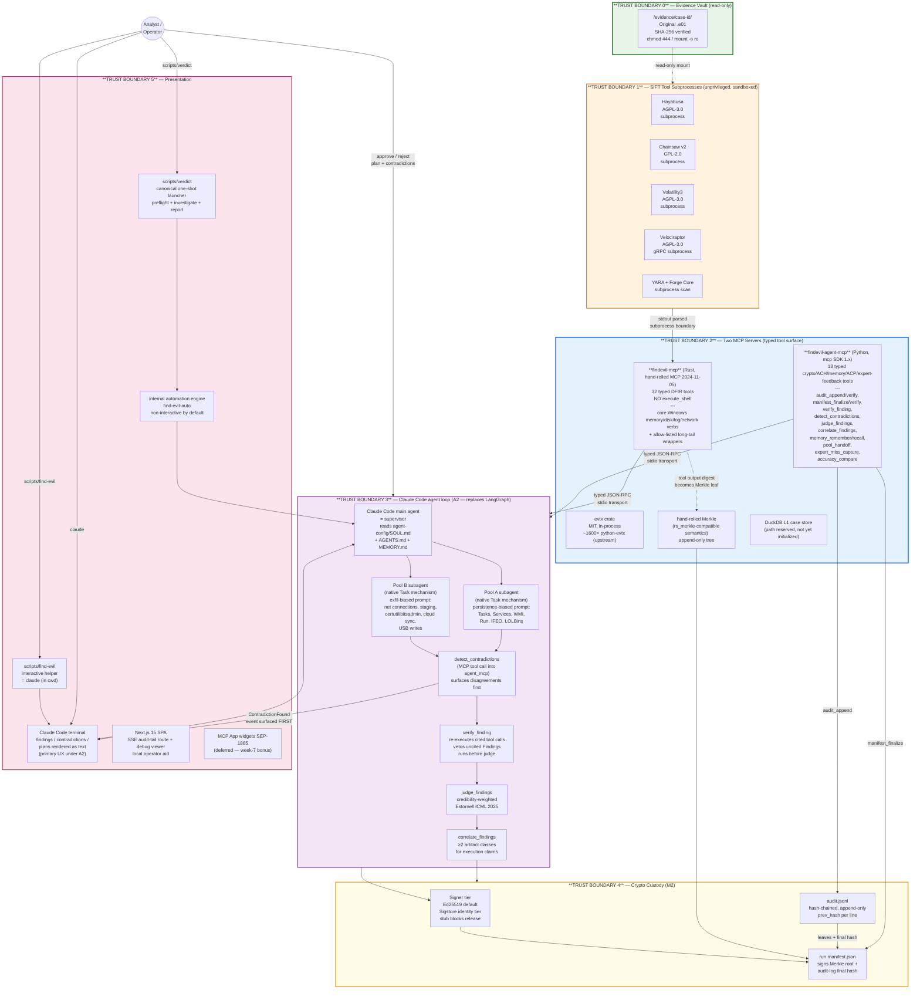
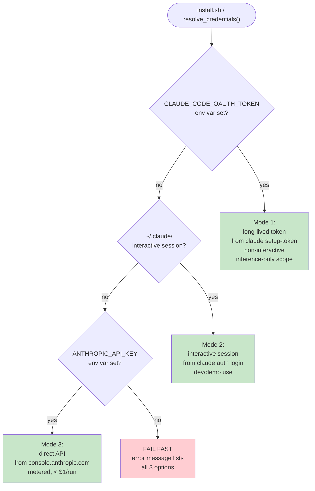

# VERDICT — Architecture

Architecture diagram with trust boundaries, distinguishing prompt-based guardrails from architectural guardrails.

This document is the single-page visual summary operators reach first. It is the public architecture source for VERDICT's seven-layer product shape, credential modes, and Claude Code primary-interface model. Current implementation detail lives in `CLAUDE.md`, `agent-config/`, and `docs/reference/mcp-and-tools.md`; older design specs were removed from the reduced source checkout and remain git-history context only.

---

## Architectural pattern claimed (under Amendment A2)

VERDICT combines **two** architectural patterns:

1. **Direct Agent Extension** — Claude Code IS the agent. The operator runs `scripts/verdict <evidence>` for the one-shot path, or `claude` / `scripts/find-evil` at the repo root for interactive exploration; `.mcp.json` auto-spawns both MCP servers; Claude Code drives the investigation as supervisor + Pool A/B subagents (native Task mechanism — not `CLAUDE_CODE_FORK_SUBAGENT`, which is a build-time internal and is not used in this product).
2. **Custom MCP Server** — two purpose-built MCP servers expose the typed tool surface:
   - `findevil-mcp` (Rust) — 32 DFIR primitives (core Windows memory/disk/log/network verbs plus allow-listed long-tail wrappers such as `vol_run`, `ez_parse`, `plaso_parse`, `mac_triage`, and `cloud_audit`). Read-only on evidence; SHA-256 every output. **NO `execute_shell`.**
   - `findevil-agent-mcp` (Python) — 13 crypto + ACH + memory + ACP + expert-feedback tools (audit_append/verify, manifest_finalize/verify, verify_finding, detect_contradictions, judge_findings, correlate_findings, memory_remember/recall, pool_handoff, expert_miss_capture, accuracy_compare). The pre-A5 `ots_stamp`/`ots_verify` pair was removed.

The combination is the architectural claim: Claude Code's agent loop never touches a raw shell because the only verbs it has are MCP-typed function calls into one of the two servers.

**Opt-in custom agent loop (A2 update).** Amendment A2 originally forbade any custom orchestrator ("Claude Code is the engine"). That stays the default — the deterministic `scripts/find_evil_auto.py` engine is what `scripts/verdict` runs. VERDICT now *also* ships a strictly **opt-in**, provider-agnostic LLM-driven investigation loop under `services/agent/findevil_agent/agentloop/`, reached only via `scripts/verdict --agent`. It is a thin loop, not a framework resurrection: it must **not** import `langgraph` or `fastapi` (the A2 content rule, still enforced by the L0 `amendment-a2-guard`), and its MCP client runs in-loop over local stdio so the read-only custody boundary the two product servers enforce is unchanged. The removed orchestrator surfaces (`graph.py`, `api.py`, `cli.py`, `supervisor.py`, `specialists/`) stay dropped and are not revived by this path.

**Maturity note.** The 32 Rust verbs are implemented as a typed, allow-listed surface. The
long-tail verbs `vol_run`, `ez_parse`, `plaso_parse`, `mac_triage`, `cloud_audit`,
`journalctl_query`, `login_accounting`, `ausearch`, `nfdump_query`, `suricata_eve`, and
`indx_parse` are fixture-tested but not yet exercised on real evidence in a committed run; the
committed sample runs prove the core disk/registry/EVTX/MFT/Prefetch/YARA/USN/Hayabusa/Sysmon/
Zeek/PCAP, `vol_*`, `vel_collect`, and `browser_history` paths.

---

## Relationship to Protocol SIFT

VERDICT runs on the same SANS SIFT VM (`sift-2026.03.24.ova`) that Protocol SIFT operates on — they are not in conflict.

**Deliberate divergence in the MCP surface:**

| Aspect | VERDICT | Protocol SIFT gateway |
|---|---|---|
| Product MCP servers | 2 typed, audit-chained servers (`findevil-mcp`, `findevil-agent-mcp`); `.mcp.json` registers 6 servers total including 4 non-product operator conveniences | 1 gateway (200+ shell-backed tools) |
| Tool count | 45 (32 Rust DFIR + 13 Python crypto/ACH/memory/ACP/expert) | 200+ (dynamic, shell coverage) |
| Shell surface | None — NO `execute_shell` | Broad — gateway is a shell pass-through |
| Use case | Repeatable DFIR mechanics for evidence investigation | General-purpose bot connectivity |
| Installation | No conflicts — separate MCP registrations | `protocol-sift install` installs the gateway independently |

After `protocol-sift install` on a SIFT VM, both VERDICT's narrow typed surface and Protocol SIFT's broad shell-backed gateway coexist. Operators choose which agent interface to use per investigation; neither requires nor conflicts with the other.

The narrow surface is intentional: it reduces the attack surface from "full shell access" to 32 named Rust DFIR operations and 13 Python cryptographic/ACH/memory/ACP/expert operations, enabling an architectural argument that the agent loop never touches shell primitives directly — all actions flow through typed JSON-RPC schema validation.

---

## Runtime architecture (the Product that operators run)

### Trust boundary legend

| # | Boundary | Enforcement mechanism | Type |
|---|---|---|---|
| 0 | Evidence vault | **Architectural (shipped):** originals opened read-only (libewf for `.e01`); SHA-256 fingerprinted at `case_open` and re-checked at every verifier replay; no write verb exists anywhere in the 45-tool product surface. **Hardened-deployment posture (recommended, not code-enforced):** `mount -o ro` + `chmod 444` on the vault, `inotifywait` write-monitoring | Code-enforced today; filesystem hardening is operator posture |
| 1 | SIFT tool subprocesses | **Architectural (shipped):** unprivileged user (no root, no CAP_SYS_ADMIN); fixed-argv invocation — `Command::new(bin).args([...])`, never `sh -c`, so a path/arg is never shell-parsed (adversarially pinned by `services/mcp/tests/bypass_paths.rs`). **Optional OS-level hardening (shipped, off by default — defense-in-depth, NOT a replacement):** a binary allow-list `Bash` PreToolUse deny-hook (`scripts/pretooluse-deny-hook.sh` + `scripts/forensic-allowlist.txt`) and a rootless-podman + seccomp + read-only-mount launcher, both documented in `docs/sandbox/optional-os-hardening.md`. **Still roadmap (not yet enforced in code):** per-call wall-clock budget, cpulimit, tmpfs work dir | Process-enforced today; allow-list/rootless sandbox are opt-in OS-level layers; resource caps are roadmap |
| 2 | Two typed MCP servers | **Architectural:** Rust `findevil-mcp` type system forbids `execute_shell`; Python `findevil-agent-mcp` Pydantic input models use `extra="forbid"`; tool surfaces fixed at compile/build time. Adding a shell passthrough would require a code change + PR + review | Compiler/schema-enforced |
| 3 | Claude Code agent loop | **Mixed:** agent system prompts (`agent-config/SOUL.md` — epistemic hierarchy, AGENTS.md — roles) are **prompt-based guardrails**; verifier veto (no Finding without `tool_call_id`) is **architectural** (Pydantic schema-level enforced at the `findevil-agent-mcp` boundary). **Real-time recovery is audit-visible and shipped:** the auto-runner (`scripts/find_evil_auto.py`) emits a named `course_correction` record when a tool or verifier path fails, escalates to a run-level `heartbeat_failure` after two consecutive recovery failures, and seals a scoped partial verdict through `heartbeat_terminated`; it also emits a `verdict_revision` record when a Finding's confidence tier flips across the judge/correlate stages (an organic conclusion-flip committed to the prev_hash-linked audit chain, offline-verifiable via `manifest_verify`); demo-only fault injection is explicitly labeled `fault_injection`. These chain-visible records are reconstructed and scored by `scripts/self-score.py` and pinned by tests (`services/agent/tests/test_self_score.py`, `test_verdict_revision.py`, `test_heartbeat_escalation.py`, `test_verifier_redispatch.py`, `test_evtx_resilience.py`). **Roadmap (not yet emitted):** explicit labeled `plan_step` / `hypothesis` / `re_evaluation` records — the recovery arc is currently shown through real failure→adjust→escalate records, not an explicit hypothesis log. | Mixed — prompt guards behavior, Pydantic/schema and audit-chain records guard data and recovery transparency |
| 4 | Crypto Custody | **Architectural:** manifest signing and Merkle root computation happen inside `findevil-agent-mcp` before any finding is user-visible. Ed25519 is the offline-verifiable default; Sigstore/Rekor is the identity + transparency-log tier; the pre-A5 OpenTimestamps/Bitcoin tier was removed so `manifest_finalize` is the terminal custody step | Cryptographic |
| 5 | Presentation | **DEFERRED to bonus (A2 §2.1).** The terminal IS the primary UX. Optional Next.js SSE bus (when shipped) is read-only from the frontend; `--unattended` mode logs `approved_by: "auto"` to the audit chain. | Auth-enforced (when present) |

### Per-boundary classification table

The legend above groups by trust-boundary number; this table is the finer-grained,
**per-control** view. Every row is classified `Architectural` (a structural control
that physically prevents the bad outcome), `Prompt` (a prompt that *guides* the
model and is allowed to fail by design), or `Mixed` (a prompt guard backed by an
architectural one). Each `Code anchor` cell points at the file:line or test that
implements the control — `path:line` anchors name the specific symbol; bare paths
name the whole file. The `Failure-mode-if-bypassed` column states what breaks if
that single control were removed, so the table doubles as a defense-in-depth map.

| Boundary | Class | Mechanism | Code anchor (file:line or test) | Failure-mode-if-bypassed |
|---|---|---|---|---|
| Read-only evidence opener | Architectural | Originals opened for reading only (libewf for `.e01` via `auto_mount_ewf`; `File::open` to SHA-256 fingerprint at `case_open`); no write verb exists anywhere in the 45-tool product surface | `services/mcp/src/tools/case_open.rs:213`, `services/mcp/src/tools/disk.rs:443` | Evidence could be mutated in place — custody broken, every downstream hash and replay invalidated |
| Fixed-argv / no-shell subprocess | Architectural | SIFT tools invoked `Command::new(bin).args([...])`, never `sh -c`, so an attacker-controlled path/arg is passed as a literal, never shell-parsed (adversarially pinned for shell-payload filenames, `..` traversal, and flag-looking paths) | `services/mcp/tests/bypass_paths.rs:118` (test) | A crafted evidence filename or tool arg could inject a shell command — arbitrary code execution on the analysis host |
| Sanitizer single pre-hash funnel | Architectural | All tool output funnels through `finalize_tool_output`, which neutralizes chat/role control tokens and strips invisible Unicode **before** hashing, so `output_sha256` attests exactly the text the model saw; the Rust funnel and Python mirror stay byte-identical | `services/mcp/src/server.rs:1230` + mirrors `services/mcp/src/sanitize.rs`, `services/agent_mcp/findevil_agent_mcp/sanitize.py:56` | Prompt injection inside evidence text reaches the model unneutralized, or a replay hash diverges from what the model saw (attestation gap) |
| Typed Rust MCP — no `execute_shell` | Architectural | The Rust tool registry is fixed at compile time; there is no `execute_shell` verb and adding one is a code change + PR + review, not a runtime config | `services/mcp/src/lib.rs:14`, `services/mcp/src/tools/mod.rs:19` | An arbitrary-command surface would re-open the very shell-injection class the fixed-argv design closes |
| Typed Python MCP — `extra="forbid"` | Architectural | Every Pydantic input model on `findevil-agent-mcp` denies unknown fields, so a malformed or smuggled argument surfaces as a validation error at the boundary, not silent acceptance | `services/agent_mcp/findevil_agent_mcp/tools/verify_finding.py:33` | Unmodeled fields could ride into a tool call and alter behavior the schema was meant to pin |
| Finding-requires-`tool_call_id` | Architectural | The `Finding` event schema makes `tool_call_id` a required field, and the verifier vetoes any Finding lacking it before the judge consumes it | `services/agent/findevil_agent/events.py:128` (field) + `services/agent/findevil_agent/verifier.py:84` (veto) | An LLM-asserted Finding with no cited tool call could enter the verdict — an unverifiable claim presented as evidence |
| ≥2-artifact-class execution gate | Architectural | Verdict-time correlation downgrades any execution-flavored claim that lacks corroboration from a second execution-artifact class (Amcache-only execution is hard-downgraded) | `services/agent/findevil_agent/correlator.py:98` + `services/agent/findevil_agent/execution_claim.py:66` | A single-artifact lead (e.g. Amcache catalog time) would be overclaimed as confirmed execution |
| Citation / entailment requirement | Architectural | A deterministic, LLM-free check proves the cited tool-call output actually entails the Finding's asserted values; the entailment slice is persisted for offline re-verification | `services/agent/findevil_agent/entailment.py:59` | A Finding could cite a real tool call whose output does not actually support the claim (citation without entailment) |
| Hash-chained `audit.jsonl` | Architectural | Each audit line embeds `prev_hash` = SHA-256 of the prior record; chain replay (and `scripts/trace-finding`) catches any backdated, mutated, or reordered entry | `services/agent/findevil_agent/crypto/audit_log.py:91` + `scripts/trace-finding` | The process/tool-call record could be silently rewritten — the audit trail stops being tamper-evident |
| Merkle + Ed25519 custody | Architectural (Cryptographic) | `manifest_finalize` builds an append-only Merkle root over the audit leaves and Ed25519-signs the canonicalized manifest body inside `findevil-agent-mcp` before any Finding is user-visible | `services/agent/findevil_agent/crypto/manifest.py:172`, `services/mcp/src/crypto/merkle.rs:89`, `services/agent/findevil_agent/crypto/signer.py:178` | The signed manifest could be forged or the leaf set rebuilt to favor a different result — offline `manifest_verify` would no longer prove integrity |
| Prompt layer (epistemic hierarchy, role scope) | Prompt | Agent system prompts set the epistemic hierarchy, specialist roles/tool scope, DFIR artifact semantics, and the per-turn injection self-check; these GUIDE behavior and are allowed to fail (the architectural rows above catch the fallout) | `agent-config/SOUL.md`, `agent-config/AGENTS.md`, `agent-config/MEMORY.md`, `agent-config/HEARTBEAT.md` | The model may reason loosely or misread an artifact — but no prompt-layer failure can by itself emit an uncited, unverified, or overclaimed Finding past the architectural gates |
| OS-level binary allow-list deny-hook | Optional / opt-in (shipped, off by default) | A `Bash` PreToolUse hook that hard-exits nonzero unless the invoked binary is on a single-source-of-truth forensic allow-list; fails closed on shell chaining or a malformed payload. **Defense-in-depth BELOW the typed-MCP boundary — never a replacement for it**, and it adds no `execute_shell`-style surface (it can only deny). Off until an operator wires it via `.claude/settings.json` | `scripts/pretooluse-deny-hook.sh`, `scripts/forensic-allowlist.txt`, test `scripts/pretooluse-deny-hook-smoke.py`; docs `docs/sandbox/optional-os-hardening.md` | When NOT enabled, the host process can run any binary the OS user can — contained by the unprivileged + fixed-argv posture of Boundary 1, not by this hook. The hook is an extra, opt-in OS-level deny layer, not the primary control |
| Rootless-podman + seccomp + read-only mount sandbox | Optional / opt-in (documented launcher posture) | A documented rootless container launcher: read-only evidence mount (`:ro`), `--cap-drop=ALL`, `no-new-privileges`, seccomp, tmpfs scratch. Contains the whole analysis process at the OS layer. Opt-in; the default `scripts/verdict` path runs natively | `docs/sandbox/optional-os-hardening.md` (launcher snippet) | Without it, a tool-subprocess compromise is bounded by the host unprivileged-user posture rather than additionally by a rootless/seccomp jail; disk-mount cases still prefer the SIFT VM |
| Resource sandbox (per-call budget, cpulimit, tmpfs) | Roadmap (honestly labeled) | Per-call wall-clock budget, cpulimit, and tmpfs work dir are documented as **roadmap, not yet enforced in code** — the shipped control today is the unprivileged + fixed-argv posture of Boundary 1 (the binary allow-list is now an optional OS-level hook, see the row above) | `docs/architecture.md:145` (roadmap note) | A runaway or resource-heavy tool subprocess is not yet wall-clock/CPU bounded; until shipped this relies on the unprivileged-user posture, not a code-enforced cap |

### Prompt-based vs architectural guardrails — explicit distinction

**Prompt-based guardrails (prompts that GUIDE behavior):**
- `agent-config/SOUL.md` epistemic hierarchy (CONFIRMED > INFERRED > HYPOTHESIS)
- `agent-config/AGENTS.md` specialist roles and tool scope
- `agent-config/MEMORY.md` DFIR artifact semantics (Amcache ≠ execution time, etc.)
- `agent-config/HEARTBEAT.md` canary string self-check every turn

Prompt guardrails can fail — that is the design assumption, not a surprise; when they do, the
architectural guardrails below must catch the fallout. What is bypass-tested **today** is the
architectural layer (`services/mcp/tests/bypass_paths.rs`: shell-payload paths, `..` traversal,
flag-looking paths — all inert), plus the HEARTBEAT.md canary as the in-run prompt-injection
tripwire. Dedicated prompt-injection *fixtures* in `goldens/` are planned and not yet shipped —
we say so here rather than claim them.

**Architectural guardrails (structural controls that PHYSICALLY PREVENT bad outcomes):**
- Read-only evidence access (code-enforced: libewf read-only open, SHA-256 at `case_open` re-checked at every replay, no write verb in the tool surface; pair with a read-only mount in hardened deployments)
- Typed Rust MCP server (`findevil-mcp`) with no `execute_shell` (compiler-enforced; adding shell passthrough requires a code change and PR review)
- Typed Python MCP server (`findevil-agent-mcp`) with Pydantic `extra="forbid"` on every input model (boundary-enforced; unknown fields surface as validation errors)
- Pydantic schema on `Finding` events requires `tool_call_id` (schema-enforced; unvalidated Findings can't exit the agent_mcp boundary)
- Hash-chained `audit.jsonl` (`prev_hash` per line; chain replay catches any backdated/mutated entry)
- manifest signing at the `findevil-agent-mcp` layer (Ed25519 default; Sigstore/Rekor when configured; explicit stub fallback blocks customer release)
- Merkle tree append-only at the `findevil-agent-mcp` layer (agent cannot rebuild the tree to favor a different leaf set)
- Sigstore/Rekor transparency-log inclusion proof when that tier is configured (agent cannot forge the signed manifest provenance)

The no-arbitrary-execution claim is machine-checkable in-repo today: the tool registry is fixed
at compile time (`services/mcp/src/tools/mod.rs` — adding a verb is a code change + review),
`scripts/divergence-smoke.py` asserts the product MCP servers register no
`execute_shell`/`bash -c`-shaped surface, and `services/mcp/tests/bypass_paths.rs` exercises the
boundary adversarially. (A third-party `mcp-scanner` pass is on the pre-release checklist; no
scanner artifact ships in this tree yet.)

---

## Credential modes (Amendment A1)

The Product (what operators run) detects three credentials in priority order via `scripts/install.sh` and `services/agent/config.py resolve_credentials()`:

All three modes are **fully supported**. Operators pick whichever they already have — none is required to build or run.

---

## Data flow — a single investigation from `.e01` to verdict (under A2)

1. Operator runs `scripts/verdict <evidence>` for a one-shot live investigation, or `claude` / `scripts/find-evil` at the repo root for interactive mode. The one-shot launcher performs preflight, starts the optional dashboard unless `--no-dashboard` is set, and delegates to the internal `find-evil-auto` engine. The interactive path uses Claude Code, which reads `.mcp.json`, spawns both MCP servers, and ingests `CLAUDE.md` + `agent-config/*` as system context.
2. In interactive mode, the operator prompts: "investigate fixtures/nist-hacking-case/SCHARDT.001". In one-shot mode, `scripts/verdict` supplies the evidence path to the internal engine. The supervisor calls `case_open` (Rust MCP) — SHA-256 verifies the image, opens via libewf read-only, reserves the `evidence.ddb` path at `~/.findevil/cases/<id>/evidence.ddb` (the DuckDB L1 store is not yet initialized), calls `audit_append` (Python MCP) for the open event.
3. Claude Code emits a plan as text (no `PlanProposed` event needed — the terminal IS the channel) and forks two subagents via the native Task mechanism: one with the Pool A persistence prompt, one with Pool B exfil.
4. Each pool subagent invokes Rust MCP DFIR tools (`evtx_query`, `mft_timeline`, `hayabusa_scan`, etc.); each call's SHA-256 output digest is `audit_append`-ed and contributes a Merkle leaf at `manifest_finalize` time.
5. Both subagents return Findings (each citing a `tool_call_id`). Supervisor calls `detect_contradictions` (Python MCP) which surfaces Pool A vs Pool B disagreements **before** the judge fires.
6. Analyst resolves contradictions (Trust A / Trust B / Flag) in the terminal, or `--unattended` mode auto-passes them.
7. Supervisor calls `verify_finding` (Python MCP) for each candidate Finding — the wrapper spawns its own short-lived `findevil-mcp` subprocess and re-runs the cited tool call. Drift downgrades the Finding by one tier.
8. Supervisor calls `judge_findings` (Python MCP) — credibility-weighted merge per Estornell ICML 2025.
9. Supervisor calls `correlate_findings` (Python MCP) — SOUL.md cross-artifact rule downgrades execution claims that lack ≥2 artifact-class corroboration; Amcache-only execution gets the hard-coded downgrade.
10. Supervisor calls `manifest_finalize` (Python MCP) — builds the Merkle root, signs the canonicalized body via the selected signer tier (Ed25519 by default, Sigstore for identity/transparency, or explicit stub for tests), writes `run.manifest.json`, and finalizes the audit chain. This is the terminal custody step under A5.
11. Supervisor renders the `RunVerdict` to the terminal with paths to the manifest and report.
12. Offline replay: `manifest_verify` reproduces the proof end-to-end, citing FRE 902(14) with the post-A5 Rekor timestamp trade-off.

---

## What we differ from the reference bar (Valhuntir)

| Dimension | Valhuntir (reference) | Us |
|---|---|---|
| MCP server | Python, 8 servers via sift-gateway, 100+ tools | **Two audit-chained product MCP servers** — Rust `findevil-mcp` (32 DFIR tools, including the deliberately-redundant `vol_pslist` + `vol_psscan` pair plus `vol_psxview` for DKOM cross-validation, disk mount/extract helpers, network/log triage, and allow-listed long-tail wrappers) + Python `findevil-agent-mcp` (13 crypto/ACH/memory/ACP/expert-feedback tools); `.mcp.json` has 6 registered servers total, but the 4 non-product helpers emit no Findings; no execute_shell |
| Agent runtime | Custom Python harness | **Claude Code** itself ("Direct Agent Extension" pattern) — no custom orchestrator to maintain |
| Chain-of-custody | Password-gated HMAC (PBKDF2 2M iter) | Ed25519/Sigstore signer tier + Merkle + audit hash chain (FRE 902(14) self-authenticating, with the A5 timestamp trade-off documented) |
| Agent pattern | Single agent + human approval | ACH dual-agent (persistence vs exfil) via Claude Code forked subagents + judge + contradiction surface |
| Benchmarks published | **None** (their README: "no performance metrics disclosed") | DFIR-Metric scoring harness + leaderboard wiring present; no score published yet (roadmap) |
| UI | Browser Examiner Portal | Claude Code terminal (primary); Next.js SPA + MCP Apps widgets (week-7 polish bonus, deferred) |
| Install pattern | `curl ... \| bash` one-liner | `curl ... \| bash` one-liner (same pattern, our repo) |
| Credential mode | 1 (their gateway config) | 3 (CLAUDE_CODE_OAUTH_TOKEN / interactive / API key) |

We match Valhuntir's architectural discipline and exceed it on three dimensions that are documented, measurable on the cases actually scored, and legally framed.

---

## References

- `README.md` + `INSTALL.md` + `QUICKSTART.md` — public install and operator contract
- `CLAUDE.md` — operating contract, run contract, and guardrails
- `docs/reference/mcp-and-tools.md` — registered MCP servers and product tool inventory
- `docs/reference/dependencies.md` — runtime dependency matrix
- `docs/sandbox/optional-os-hardening.md` — optional, opt-in OS-level deny-hook + rootless sandbox (defense-in-depth below the typed-MCP boundary)
- `agent-config/SOUL.md` + `AGENTS.md` + `TOOLS.md` + `MEMORY.md` + `HEARTBEAT.md` — runtime agent identity
