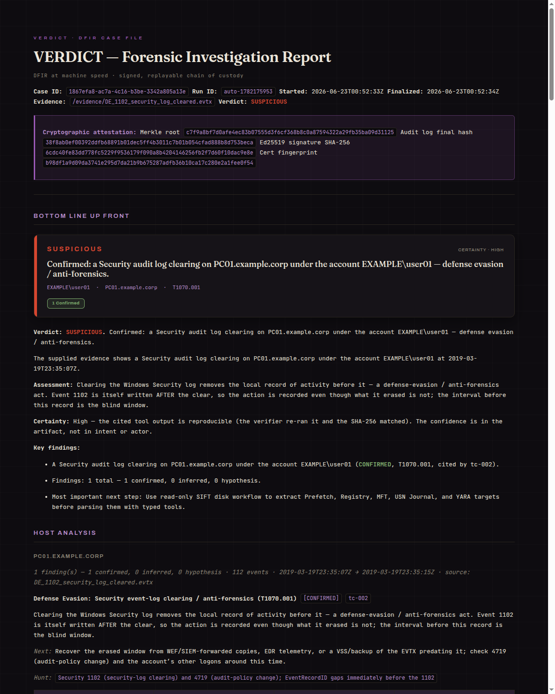
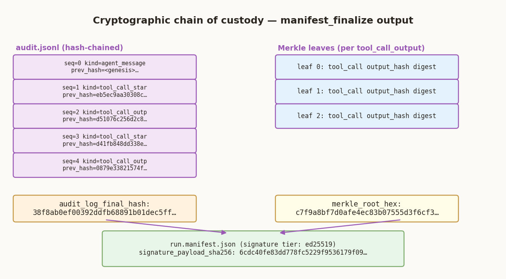

# `docs/showcase/` — VERDICT showcase (see it run)

The whole workflow, end to end: **install → invoke → investigate → watch → verdict.**
Every screen capture below is a real run against real evidence (an EVTX directory + a NIST disk
image), not a mockup — the one exception is the chain-of-custody figure in §6, which is a labeled
diagram of the `manifest_finalize` output structure, not a capture. In the terminal captures the
operator's home path is shown as `~` for privacy; the dashboard/report show the SIFT VM's standard
`sansforensics` user. Nothing else is edited.

Showcase visuals should use the v2 assets and palette documented in
[`../brand.md`](../brand.md). Styling is presentation only; it never creates a
Finding or upgrades a confidence tier.

## 1 · Install — one preflight, then green

`scripts/doctor.sh` checks the whole toolchain in seconds and prints an honest summary.

## 2 · Invoke — one command in Claude Code

VERDICT *is* a Claude Code agent (Amendment A2). You type one line — `investigate <evidence>`
— and the agent scopes the case and takes over.

## 3 · Investigate — the DFIR pipeline solves the case

`case_open` SHA-256s the evidence, forks Pool A (persistence) + Pool B (exfil), runs the typed
DFIR tools (EVTX, Hayabusa, prefetch, …), a verifier re-checks every finding, the judge merges
them, and the run is sealed into a signed manifest — ending on the verdict and `manifest_verify = PASS`.

## 4 · Watch it live — the dashboard

Every tool call and finding streams to the dashboard the moment it lands, each tagged
`CONFIRMED` / `INFERRED` / `HYPOTHESIS` and citing the exact `tool_call_id` behind it.

| Verdict stream | Finding detail |
|---|---|
|  |  |

## 5 · The verdict + the report

A signed, evidence-bound verdict (`SUSPICIOUS` / `INDETERMINATE` / `NO_EVIL`) and a full analyst
report — every finding traceable to a tool call, the whole chain verifiable offline.

| Verdict | Tool-cited findings | Analyst report |
|---|---|---|
|  |  |  |

A focused example — the rendered report for the EID-1102 *Security log cleared* case, the same
evidence as the committed, offline-verifiable
[`docs/release-evidence/sample-run/`](../release-evidence/sample-run/) receipt:

## 6 · Verify it offline — the chain of custody

A diagram (not a screen capture) of what `manifest_finalize` seals: the hash-chained
`audit.jsonl`, one Merkle leaf per `tool_call_output`, and the `audit_log_final_hash` +
`merkle_root_hex` bound into an ed25519-signed `run.manifest.json` that `manifest_verify` replays
offline.

---

Reproduce any of these with the recipes in
[`scripts/make-demo-video/CAPTURE.md`](../../scripts/make-demo-video/CAPTURE.md), or just run
`scripts/verdict <evidence>` yourself.
